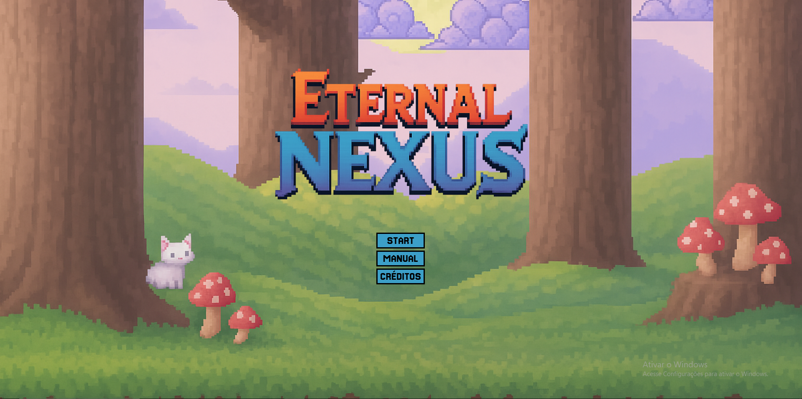

# Eternal Nexus



**Eternal Nexus** é um jogo de luta online em pixel art, totalmente desenvolvido como um projeto independente. Combinando ação em tempo real, gráficos retrô e multiplayer via rede, o jogo oferece uma experiência intensa e divertida entre amigos ou adversários aleatórios.  

O projeto foi desenvolvido por uma equipe apaixonada por jogos e tecnologia, com muito esforço, dedicação e trabalho em equipe!

---

## 👥 Equipe e Colaboradores

- **João Victor de Abreu Cunha** – *Líder do Grupo, Idealizador do Projeto & Scrum Master*  
  Responsável por coordenar todas as etapas do desenvolvimento, organizando a equipe com metodologias ágeis (Scrum) e conduzindo a definição da arquitetura do sistema. Atuou diretamente na implementação do sistema multiplayer, desenvolvendo a lógica de jogo em tempo real e a comunicação entre servidor e cliente utilizando Socket.IO.  
  Também foi responsável pela configuração e deploy da infraestrutura em produção, utilizando Google Cloud, PM2 para gerenciamento de processos e NGINX como proxy reverso. Assumiu os principais desafios técnicos e garantiu a integração entre os diferentes módulos do projeto.

- **Bryan Prinz** – *Desenvolvedor*  
  Trabalhou diretamente na interface do usuário e na lógica de interação, colaborando com a construção do frontend, integração com a engine de jogo e elementos de controle dos jogadores.

- **Yan Bueno Goular** – *Desenvolvedor*  
  Contribuiu com funcionalidades fundamentais para a jogabilidade, como movimentação, detecção de colisões e lógica dos estados de luta. Atuou também no suporte e testes gerais do sistema.

- **João Santos** – *Design & Áudio*  
  Responsável pela criação dos visuais do jogo, incluindo sprites dos personagens, cenários e mapas. Também desenvolveu os efeitos sonoros e trilha sonora original, garantindo a imersão e identidade sonora do projeto.

- **Nicolas Jose Prim** – *Design & Áudio*  
  Atuou no design das interfaces visuais, menus e HUD do jogo, além de colaborar na composição de sons e efeitos que enriqueceram a experiência do usuário.

---

## ⚙️ Tecnologias Utilizadas

Este projeto foi construído com as seguintes tecnologias e ferramentas:


---

### 🔧 Estrutura do Projeto

- **Frontend:**
  - HTML5, CSS3 e JavaScript
  - Canvas API
  - DOM API para interações dinâmicas com a interface

- **Backend:**
  - Node.js com Express
  - WebSockets com Socket.IO

- **Infraestrutura:**
  - Google Cloud VM
  - PM2 para gerenciamento de processos
  - NGINX como proxy reverso

---

## 🙏 Agradecimentos

Agradecemos aos **professores, orientadores** e a todos que contribuíram direta ou indiretamente para tornar este projeto possível.  
Este jogo é fruto de muito aprendizado, esforço coletivo e paixão por desenvolvimento de jogos.

---

## 🚀 Como Rodar o Projeto Localmente

Quer testar o **Eternal Nexus** no seu computador? Siga este passo a passo detalhado:

> ⚠️ **Aviso:**  
> O multiplayer não funcionará quando o jogo for executado apenas em sua máquina local.  
> Para testar partidas em rede, você pode expor seu servidor usando ferramentas como ngrok em sua própria máquina ou fazer o deploy em um servidor na nuvem (Google Cloud, AWS, Azure, etc.).

### 1️⃣ Requisitos

- [Node.js](https://nodejs.org/) (v14 ou superior)  
- [Git](https://git-scm.com/)

---

### 2️⃣ Clone o repositório

```bash
git clone https://github.com/joaosesizada/game_combat.git
```

### 3️⃣ Acesse o diretório do projeto

```bash
cd game_combat
```

### 4️⃣ Instale as dependências

```bash
npm install
```

### 5️⃣ Inicie o servidor

```bash
npm start
```

### 6️⃣ Abra o jogo no navegador

```bash
http://localhost:3000
```

